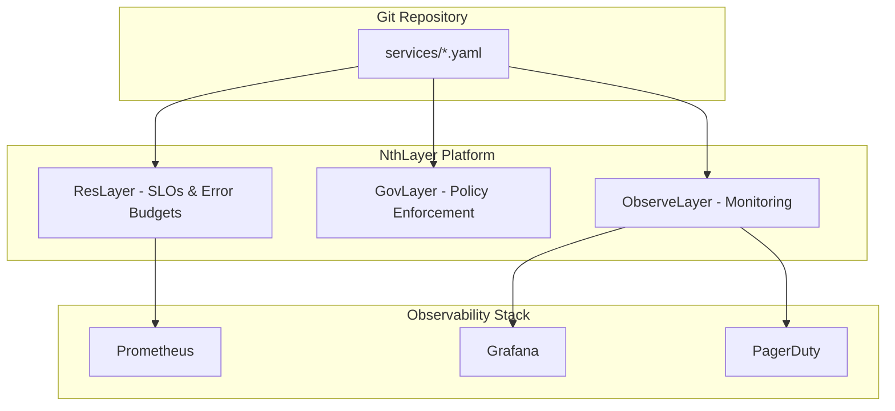

# NthLayer

**Reliability at build time, not incident time.**

NthLayer is the Reliability Shift Left platform - bringing production readiness validation into your CI/CD pipeline. Instead of discovering reliability issues in production, catch them before deployment.

## Product Vision & Scope

**Core Value Proposition:** "Validate reliability requirements before deploy, not after incidents"

### Reliability Shift Left

| Stage | What NthLayer Does |
|-------|-------------------|
| **Generate** | Create dashboards, alerts, SLOs from service.yaml |
| **Lint** | Validate PromQL syntax before Prometheus rejects it |
| **Verify** | Confirm declared metrics exist in Prometheus |
| **Gate** | Block deploys when error budget exhausted |

**The key insight:** Generation is just the mechanism. The value is **prevention**.

### Competitive Positioning

| Competitor | Their Focus | NthLayer Difference |
|------------|-------------|---------------------|
| **PagerDuty** | Incident response | "They respond to incidents, we prevent them" |
| **Datadog** | Post-deploy monitoring | "They monitor after, we validate before" |
| **Nobl9** | SLO tracking | "They track SLOs, we enforce them as gates" |
| **Backstage** | Service catalog | "They document, we generate and enforce" |

**Strategic focus:** Compete where they won't go - build-time reliability validation.

### The Three Layers



> **See also:** [Full Architecture Documentation](docs-site/architecture.md) for detailed diagrams of workflows and integrations.

### Usage Modes

| Mode | Description | Catalog Required? |
|------|-------------|-------------------|
| **Standalone** | Git + YAML, no catalog | ❌ No - Start here |
| **With Catalog** | Sync metadata from Backstage/Cortex | Optional |
| **Hybrid** | Catalog + local overrides | Optional |

**Key differentiator:** Catalogs make you adopt their platform first. NthLayer works Day 1.

### What We Generate

| Domain | Output | Status |
|--------|--------|--------|
| **Dashboards** | Grafana dashboards, Datadog dashboards | ✅ Grafana done, 📋 Datadog planned |
| **Alerts** | Prometheus rules, Datadog monitors | ✅ Prometheus done, 📋 Datadog planned |
| **Recording Rules** | Pre-aggregated metrics | ✅ Complete |
| **PagerDuty** | Teams, schedules, escalation policies | ✅ Complete |
| **SLOs** | OpenSLO definitions, error budgets | 🔨 ResLayer Phase 1 |
| **Deployment Gates** | ArgoCD blocking, CI/CD integration | 📋 ResLayer Phase 2 |
| **Policies** | Resource limits, deployment rules | 📋 GovLayer |
| **Runbooks** | Auto-generated troubleshooting guides | 📋 ObserveLayer |
| **Chaos Experiments** | Litmus ChaosEngine manifests | 📋 Phase 8 |
| **Synthetic Probes** | Cloudprober configs | 📋 Phase 8 |

## Roadmap

### Strategic Differentiation
**Primary narrative: Reliability Shift Left**
- Prevention over response - catch issues before production
- CI/CD integration - verification and gates as pipeline steps
- Cross-vendor SLO Portfolio (they want lock-in)

**Core differentiators:**
- `nthlayer verify` - Contract verification (metrics exist)
- `nthlayer check-deploy` - Deployment gates (error budget)
- `nthlayer apply --lint` - PromQL validation
- Generation is the mechanism, prevention is the value

**Complementary tool integrations:**
- promruval - Enhanced rule validation (40+ validators)
- Litmus - Chaos experiment generation
- Cloudprober - Synthetic monitoring config

**Don't compete with (for now):**
- Incident pattern learning (PagerDuty Insights)
- Automated incident response (PagerDuty SRE Agent)

**Future consideration (Phase 7):**
- Adaptive alert tuning, deployment risk scoring, closed-loop policies
- Decision point: Review after Phase 5 completion

### Phase 1: Foundation (✅ DONE)
- service.yaml spec and parser
- Grafana dashboard generation
- Prometheus alert generation
- PagerDuty integration
- pint PromQL linting

### Phase 2: Error Budgets (✅ DONE)
- `nthlayer slo show/list` - View SLOs from service.yaml
- `nthlayer slo collect` - Real-time Prometheus queries (stateless)
- Blame deferred until CI/CD integration

### Phase 2.5: Loki Integration (📋 PLANNED)
**Goal:** Complete observability with logs (same Grafana ecosystem)
- `trellis-loki-epic`: Loki/LogQL integration
- `trellis-loki-alerts`: Generate LogQL alert rules from service.yaml
- `trellis-loki-templates`: Technology-specific log patterns (PostgreSQL, Redis, Kafka)

### Phase 3: SLO Portfolio (🔨 NEXT - Differentiator)
**Goal:** Stateless, cross-service SLO aggregation for CI/CD pipelines

- `trellis-portfolio-epic`: SLO Portfolio epic
- `trellis-portfolio-cmd`: `nthlayer portfolio` command
  - Aggregate SLO status across all services/*.yaml
  - Query Prometheus in real-time (stateless)
  - Exit codes: 0=healthy, 1=warning, 2=critical
- `trellis-portfolio-output`: Multiple output formats
  - `--format json` → pipe to dashboards, APIs
  - `--format csv` → spreadsheets, data pipelines
  - `--format markdown` → PR comments, Slack, docs
  - `--format table` → terminal (default)
- `trellis-portfolio-health`: Health scoring by tier
  - Tier-1 services weighted higher
  - Org-wide reliability score (0-100)
- `trellis-portfolio-insights`: Actionable recommendations
  - "3 services below 99% availability target"
  - "checkout-service burned 80% of monthly budget"

**Design principles:**
- Stateless: No database, queries Prometheus each run
- Pipeline-first: Exit codes, machine-readable output
- Composable: Output feeds into Grafana, Datadog, Slack, etc.

### Phase 3.5: Enhanced Validation (📋 PLANNED)
**Goal:** Beyond pint - comprehensive rule validation with promruval
- `trellis-promruval`: Evaluate promruval integration
- Enhanced metadata validation (playbook URLs exist, label patterns)
- Thanos/Mimir/Loki rule support
- `nthlayer apply --validate-metadata` flag

### Phase 4: AI-Assisted Generation
**Goal:** Conversational service.yaml creation (complements, doesn't compete with PD)
- `trellis-ai-epic`: AI/MCP strategy
- `trellis-mcp-server`: NthLayer as MCP tool for Claude/Cursor
- `trellis-ai-spec-gen`: "Create a tier-1 API with Redis" → YAML
- `trellis-ai-slo`: SLO target recommendations
- `trellis-ai-suggestions`: Best practice recommendations

### Phase 5: Deployment Gates (ResLayer Phase 2)
**Goal:** Deploy blocked when error budget < 10%
- `trellis-tnr`: Policy YAML DSL
- `trellis-a4d`: Condition evaluator
- `trellis-0fl`: ArgoCD blocking
- Requires CI/CD integration: ArgoCD, GitHub Actions, Tekton, GitLab CI

### Phase 6: NthLayer Cloud (Future - Monetization)
- Hosted portfolio dashboard
- Multi-user / team views
- Alerting on portfolio health
- Enterprise features

### Phase 7: Intelligent Reliability (Future - "New Class")
**Goal:** Adaptive, learning reliability automation - transform from generation tool to intelligent platform

- `trellis-adaptive-alerts`: Adaptive Alert Tuning
  - Baseline learning from historical metrics
  - Auto-adjust thresholds based on seasonality
  - Anomaly-aware alerting (reduce noise)

- `trellis-deploy-risk`: Deployment Risk Scoring
  - ML model: error budget state + deploy history → risk score
  - Pre-deploy risk assessment
  - Integration with deployment gates (Phase 5)

- `trellis-closed-loop`: Closed-Loop Policy Updates
  - Auto-adjust SLO targets based on actual performance
  - Suggest tier promotions/demotions
  - Policy drift detection and correction

**Prerequisites:** Phase 4 (AI foundation), Phase 5 (deployment gates)
**Decision point:** Review after Phase 5 - compete or complement PagerDuty?

### Phase 8: Reliability Testing (Future)
**Goal:** Generate reliability tests alongside monitoring - complete Shift Left

- `trellis-litmus`: Litmus Chaos Experiment Generation
  - Generate chaos experiments from service.yaml dependencies
  - ChaosHub integration for common failure scenarios
  - Pod-kill, network-latency, resource-stress experiments
  - "Test failures before they happen in production"

- `trellis-cloudprober`: Synthetic Monitoring Config
  - Generate Cloudprober configs from service.yaml endpoints
  - HTTP, TCP, DNS probes for external monitoring
  - Probe results feed into SLI metrics

**Prerequisites:** Phase 5 (deployment gates), stable service.yaml spec

### Technology Templates (Ongoing)
- `trellis-0cd`: Kafka (consumer lag, partitions, replication)
- `trellis-e8w`: MongoDB (connections, replication, locks)
- `trellis-ai-services`: AI/ML service type (GPU utilization, model latency, inference queue)

## Core Commands

```bash
# Install dependencies
pip install -e ".[dev]"

# Run tests
make test                    # All tests
pytest tests/test_X.py -v    # Single test file
pytest -k "test_name" -v     # Single test by name

# Linting and type checking
make lint                    # Run ruff linter
make lint-fix                # Auto-fix lint issues
make typecheck               # Run mypy
make format                  # Format code with ruff

# Development environment
make dev-up                  # Start Postgres + Redis in Docker
make dev-down                # Stop Docker services
make migrate                 # Run database migrations

# Demo commands
python -m nthlayer.demo --help           # CLI help
python regenerate_hybrid_dashboards.py   # Regenerate all dashboards
python scripts/validate_dashboard_metrics.py  # Validate metric coverage
```

## Project Layout

```
src/nthlayer/
├── cli/           → CLI commands (plan, apply, status)
├── dashboards/    → Dashboard generation (hybrid model, intent templates)
│   ├── builder_sdk.py      → Main SDK-based dashboard builder
│   ├── resolver.py         → Metric resolution (intent → discovered metrics)
│   ├── intents.py          → Intent definitions with candidate metrics
│   └── templates/          → Technology-specific templates
│       ├── base_intent.py          → Base class for intent templates
│       ├── http_intent.py          → API service health panels
│       ├── worker_intent.py        → Worker service panels
│       ├── stream_intent.py        → Stream processing panels
│       ├── postgresql_intent.py    → PostgreSQL dependency panels
│       ├── redis_intent.py         → Redis dependency panels
│       └── elasticsearch_intent.py → Elasticsearch dependency panels
├── discovery/     → Live Prometheus metric discovery
├── slos/          → SLO definitions and error budget tracking
├── alerts/        → Alert rule generation
├── specs/         → Service specification models (ServiceContext, Resource)
├── recording_rules/ → Prometheus recording rule generation
├── orchestrator.py  → Unified plan/apply workflow
└── demo.py        → CLI entrypoint (60KB, comprehensive demo)

tests/             → pytest test suite (28+ test files)
demo/fly-app/      → Live demo app deployed to Fly.io
generated/         → Output directory for generated dashboards
docs/              → GitHub Pages demo site
scripts/           → Utility scripts (validation, migration)
.beads/            → Issue tracking (beads format)
```

## Development Patterns & Constraints

### Dashboard Generation (Hybrid Model)
- **Intent-based templates**: Define what metrics SHOULD exist, resolve to what DOES exist
- **Service types**: `api`, `worker`, `stream` - each has different health metrics
- **Row organization**: Dashboards organized into "SLO Metrics" → "Service Health" → "Dependencies"
- **Guidance panels**: Show "No Data - Check metric instrumentation" for missing metrics

### Status Label Conventions (CRITICAL)
| Service Type | Success Pattern | Error Pattern |
|--------------|-----------------|---------------|
| API          | `status!~"5.."` | `status=~"5.."` |
| Worker       | `status!="failed"` | `status="failed"` |
| Stream       | `status!="error"` | `status="error"` |

### PromQL Query Patterns
- Always use `service="$service"` label selector (NOT `cluster` or other labels)
- histogram_quantile MUST include `sum by (le)`:
  ```promql
  histogram_quantile(0.95, sum by (le) (rate(http_request_duration_seconds_bucket{service="$service"}[5m])))
  ```
- Rate queries should aggregate: `sum(rate(metric{service="$service"}[5m]))`

### Coding Style
- Python 3.9+ with type hints
- Pydantic models for data validation
- Use `structlog` for logging
- Prefer composition over inheritance
- Tests first when fixing bugs

### External Service SDKs (CRITICAL)
Always use official SDKs/clients for external service integrations. Do not create bespoke HTTP clients when official libraries exist.

| Service | Official SDK | Package |
|---------|--------------|---------|
| **PagerDuty** | `pagerduty` | `pagerduty>=6.0.0` |
| **Grafana** | `grafana-foundation-sdk` | `grafana-foundation-sdk>=0.0.11` |
| **AWS** | `boto3` / `aioboto3` | `boto3>=1.34.0` |
| **Slack** | `slack_sdk` | (add when needed) |

When integrating a new external service:
1. Research if an official SDK exists
2. If yes, add to `pyproject.toml` and use it
3. If no official SDK, check for well-maintained community libraries
4. Only create custom HTTP clients as a last resort

### Technology Templates
When adding a new database/cache template:
1. Create `src/nthlayer/dashboards/templates/{tech}_intent.py`
2. Extend `BaseIntentTemplate`
3. Add intent definitions to `src/nthlayer/dashboards/intents.py`
4. Register in `src/nthlayer/dashboards/templates/__init__.py`
5. Add test cases to `tests/test_hybrid_dashboard_builder.py`

## Git Workflow

1. Branch from `safeharbor` (current development branch)
2. Run `make lint && make typecheck && make test` before committing
3. Commit messages: `<type>: <description>` (e.g., `fix: Add sum by (le) to histogram queries`)
4. Update `.beads/issues.jsonl` when completing tasks

## Beads Issue Tracking

**Always update `.beads/issues.jsonl` when:**
1. **Starting work** on a feature/improvement not already tracked - create a new issue
2. **Completing work** - close the issue with `status: "closed"` and `close_reason`
3. **Discovering new work** during implementation - add new issues for follow-ups

**Issue format (JSONL - one JSON object per line):**
```json
{"id":"trellis-xxx","title":"Feature title","description":"What was done","status":"closed","priority":0,"issue_type":"feature","created_at":"2025-12-05T12:00:00Z","updated_at":"2025-12-05T12:00:00Z","closed_at":"2025-12-05T12:00:00Z","close_reason":"Complete: brief summary"}
```

**Priority levels:** 0 (highest) → 3 (lowest)
**Issue types:** `epic`, `feature`, `task`
**Status:** `open`, `in_progress`, `closed`

**Key principle:** If you're doing significant work, it should be tracked in beads. This ensures roadmap visibility and historical record of changes.

## PyPI Releases

**Cadence:** Monthly releases + hotfixes as needed

**Versioning:** `0.X.Y` (pre-1.0 alpha)
- X = Feature releases (monthly)
- Y = Patches/hotfixes (as needed)

**Release Process (uses Trusted Publishing - no tokens needed):**

```bash
# 1. Update version in pyproject.toml
# Example: "0.1.0a1" → "0.1.0a2"

# 2. Update CHANGELOG.md with changes

# 3. Commit and tag
git add pyproject.toml CHANGELOG.md
git commit -m "release: vX.Y.Z"
git tag -a vX.Y.Z -m "Release vX.Y.Z - description"

# 4. Push to GitHub
git push origin develop
git push origin vX.Y.Z

# 5. Create GitHub Release (triggers PyPI publish)
gh release create vX.Y.Z --title "vX.Y.Z - Title" --notes "Release notes here"
```

**What happens automatically:**
- `.github/workflows/release.yml` triggers on release publish
- Builds package with `python -m build`
- Publishes to PyPI via trusted publishing (no API token needed)
- Trusted publisher configured at: https://pypi.org/manage/project/nthlayer/settings/publishing/

**Verify release:**
```bash
pip install nthlayer==X.Y.Z
```

## Testing Requirements

Before completing any task:
1. Run `make test` - all tests must pass
2. Run `make lint` - no linting errors
3. Run `make typecheck` - no type errors
4. For dashboard changes: run `python scripts/validate_dashboard_metrics.py`

### CLI Command Testing (CRITICAL)

**When adding or modifying CLI commands, you MUST:**

1. **Manual CLI verification** - Run the command to ensure no errors:
   ```bash
   # Test help output
   nthlayer <command> --help

   # Test actual execution (use --dry-run where available)
   nthlayer <command> [args]
   ```

2. **Add unit tests** - Create/update tests in `tests/test_cli_*.py`:
   ```python
   def test_my_command_runs_without_error():
       result = runner.invoke(cli, ['my-command', '--help'])
       assert result.exit_code == 0

   def test_my_command_produces_expected_output():
       result = runner.invoke(cli, ['my-command', 'arg'])
       assert 'expected output' in result.output
   ```

3. **Test error handling** - Verify graceful failures:
   - Missing required arguments
   - Invalid input files
   - Missing dependencies (e.g., pint not installed)
   - Connection failures to external services

4. **Update command documentation** - If adding new commands:
   - Add to `docs-site/commands/` if significant
   - Update `docs-site/reference/cli.md`

**Common CLI bugs to avoid:**
- Calling methods that don't exist (always verify the interface)
- Missing imports in CLI modules
- Incorrect argument parsing
- Exit codes (0 for success, non-zero for errors)

### Test Patterns
```python
# Use pytest fixtures for common setup
# Mock external services (Grafana, Prometheus) with respx
# Test intent resolution with known metric sets
# Validate PromQL query syntax in tests
```

## External Services

| Service | Purpose | Config |
|---------|---------|--------|
| Grafana Cloud | Dashboard hosting | `NTHLAYER_GRAFANA_URL`, `NTHLAYER_GRAFANA_API_KEY` |
| Fly.io | Demo app hosting | `https://nthlayer-demo.fly.dev` |
| Prometheus | Metric discovery | Via Grafana Cloud or direct |

## Current Focus Areas

Check `.beads/issues.jsonl` for the latest priorities. Key epics:

| Epic | Description | Key Issues |
|------|-------------|------------|
| **Error Budget Foundation** | SLO tracking, burn rates, budget alerts | `trellis-3h6` |
| **Deployment Policies & Gates** | Block deploys when error budget exhausted | `trellis-3e6` |
| **Intelligent Alerts** | Smart alerting with explanations | `trellis-tt3` |
| **Observability Expansion** | APM, tracing, log aggregation | `trellis-7pw` |
| **Compliance & Governance** | SOC2, GDPR, audit logging | `trellis-gmi` |

### Technology Templates to Add
- `trellis-0cd`: Kafka
- `trellis-e8w`: MongoDB
- `trellis-ys8`: RabbitMQ
- `trellis-uum`: Elasticsearch (✅ done)

## Gotchas

1. **Row panels in Grafana**: For expanded rows, panels must be at root level (not nested in row). Use `dash.with_row(row)` then `dash.with_panel(panel)`.

2. **Metric resolution cache**: Clear `resolver._resolution_cache` between services when regenerating multiple dashboards.

3. **Intent candidates**: When metrics aren't resolving, check `intents.py` for missing candidate metric names.

4. **Grafana SDK quirk**: `Row().with_panel()` sets `collapsed=True` automatically. Don't nest panels if you want expanded rows.

5. **Demo app metrics**: Intentionally missing metrics (`redis_db_keys` from notification-worker, `elasticsearch_jvm_memory_*` from search-api) to demonstrate guidance panels.

## Evidence Required for PRs

- All tests pass (`make test`)
- Lint clean (`make lint`)
- Type check passes (`make typecheck`)
- For dashboard changes: validation script shows 100% coverage or explains gaps
- Beads issue updated if applicable
