```mermaid
architecture-beta
   group dev(mdi:code-braces) [Development]
   group validation(mdi:check-circle) [Validation]
   group deploy(mdi:rocket-launch) [Deployment]

   service code(mdi:git) [Git Push] in dev
   service spec(mdi:file-code) [Service Spec] in dev

   service lint(mdi:code-tags-check) [PromQL Lint] in validation
   service verify(mdi:check-decagram) [Metric Verify] in validation
   service budget(mdi:target) [Budget Check] in validation

   service gate(mdi:gate) [Deploy Gate] in deploy
   service prod(mdi:server) [Production] in deploy

   code:R --> L:spec
   spec:R --> L:lint
   lint:R --> L:verify
   verify:R --> L:budget
   budget:R --> L:gate
   gate:R --> L:prod
```

# Architecture

This page provides comprehensive documentation of NthLayer's architecture, components, and tech stack.

## Platform Architecture

The NthLayer platform sits between your service definitions and your observability stack, generating the complete reliability infrastructure.

```mermaid
architecture-beta
   group git(logos:git-icon) [Git Repository]
   group nthlayer(mdi:cog) [NthLayer Platform]
   group observability(mdi:cloud) [Observability Stack]

   service specs(mdi:file-code) [Service Definitions] in git

   service reslayer(mdi:target) [ResLayer SLOs] in nthlayer
   service govlayer(mdi:shield-check) [GovLayer Policies] in nthlayer
   service obslayer(mdi:eye) [ObserveLayer Monitoring] in nthlayer

   service prometheus(logos:prometheus) [Prometheus] in observability
   service grafana(logos:grafana) [Grafana] in observability
   service pagerduty(logos:pagerduty) [PagerDuty] in observability

   specs:R --> L:reslayer
   specs:R --> L:govlayer
   specs:R --> L:obslayer

   reslayer:R --> L:prometheus
   obslayer:R --> L:grafana
   obslayer:R --> L:pagerduty
```

---

## Tech Stack

NthLayer is built on these core technologies:

| Category | Technology | Purpose |
|----------|------------|---------|
| **Runtime** | Python 3.11+ | Core language |
| **CLI** | argparse + Rich | Command parsing and terminal UI |
| **HTTP Client** | httpx | Async HTTP for Prometheus, Grafana APIs |
| **Validation** | Pydantic | Schema validation for service specs |
| **Dashboard SDK** | grafana-foundation-sdk | Type-safe Grafana dashboard generation |
| **PagerDuty SDK** | pagerduty | Official PagerDuty API client |
| **Database** | SQLAlchemy + PostgreSQL | State storage (optional, for SLO history) |
| **Cache** | Redis | Caching layer (optional) |
| **Logging** | structlog | Structured JSON logging |
| **Resilience** | tenacity + circuitbreaker | Retry logic and circuit breakers |
| **Config** | PyYAML + Pydantic Settings | YAML parsing and environment config |

---

## Core Modules

NthLayer is organized into these modules:

### Specification and Orchestration

| Module | Purpose | Key Components |
|--------|---------|----------------|
| `specs/` | Parse and validate service.yaml files | `ServiceContext`, `Resource`, `parse_service_file()` |
| `orchestrator.py` | Coordinate the generation workflow | `ServiceOrchestrator`, `ApplyResult`, `PlanResult` |
| `config/` | Configuration and secrets management | `Settings`, `get_settings()`, secrets providers |

### Generation Modules

| Module | Purpose | Key Components |
|--------|---------|----------------|
| `dashboards/` | Generate Grafana dashboards with 18+ technology templates | `DashboardBuilder`, `IntentResolver`, technology templates |
| `alerts/` | Generate Prometheus alerting rules | `AlertTemplateLoader`, `AlertRule` |
| `recording_rules/` | Generate Prometheus recording rules for performance | `build_recording_rules()`, `RecordingRule` |
| `slos/` | SLO definitions, error budgets, and tracking | `SLO`, `ErrorBudgetCalculator`, `SLOCollector` |
| `pagerduty/` | PagerDuty teams, schedules, escalation policies | `PagerDutyResourceManager`, `EventOrchestrationManager` |
| `loki/` | Generate LogQL alerting rules | `LokiAlertGenerator`, `LogQLAlert` |

### Validation and Verification

| Module | Purpose | Key Components |
|--------|---------|----------------|
| `validation/` | PromQL syntax and metadata validation | `validate_promql()`, `validate_metadata()`, pint integration |
| `verification/` | Verify declared metrics exist in Prometheus | `MetricVerifier`, `MetricContract`, `VerificationResult` |
| `discovery/` | Discover available metrics from Prometheus | `MetricDiscoveryClient`, `MetricClassifier` |

### Policy and Portfolio

| Module | Purpose | Key Components |
|--------|---------|----------------|
| `policies/` | Deployment policy evaluation | `ConditionEvaluator`, `PolicyContext` |
| `portfolio/` | Cross-service SLO aggregation | `PortfolioAggregator`, `collect_portfolio()` |

### Providers and Integrations

| Module | Purpose | Key Components |
|--------|---------|----------------|
| `providers/` | External service integrations | Grafana, Prometheus, PagerDuty providers |
| `clients/` | HTTP clients with retry/circuit breaker | `CortexClient`, `PagerDutyClient`, `SlackNotifier` |
| `integrations/` | High-level integration helpers | `PagerDutySetupResult` |

---

## CLI Commands

### Generation Commands

| Command | Purpose | Exit Codes |
|---------|---------|------------|
| `nthlayer apply <service.yaml>` | Generate all resources (dashboards, alerts, SLOs, etc.) | 0=success, 1=error |
| `nthlayer plan <service.yaml>` | Preview what would be generated (dry-run) | 0=success |
| `nthlayer init` | Create a new service.yaml interactively | 0=success |

### Validation Commands

| Command | Purpose | Exit Codes |
|---------|---------|------------|
| `nthlayer apply --lint` | Validate PromQL syntax using pint | 0=valid, 1=errors |
| `nthlayer validate <service.yaml>` | Validate service.yaml schema | 0=valid, 1=invalid |
| `nthlayer verify <service.yaml>` | Verify declared metrics exist in Prometheus | 0=all exist, 1=missing |

### Enforcement Commands

| Command | Purpose | Exit Codes |
|---------|---------|------------|
| `nthlayer check-deploy <service.yaml>` | Check error budget before deploy | 0=safe, 1=budget exhausted |
| `nthlayer portfolio [--format json]` | Aggregate SLO health across all services | 0=healthy, 1=warning, 2=critical |

### SLO Commands

| Command | Purpose |
|---------|---------|
| `nthlayer slo show <service>` | Display SLO status for a service |
| `nthlayer slo list` | List all defined SLOs |
| `nthlayer slo collect <service>` | Collect current SLO metrics from Prometheus |

### Configuration Commands

| Command | Purpose |
|---------|---------|
| `nthlayer setup` | Interactive configuration wizard |
| `nthlayer config show` | Display current configuration |
| `nthlayer env list` | List environment configurations |

```mermaid
architecture-beta
   group generate(mdi:cog) [Generate]
   group validate(mdi:check-circle) [Validate]
   group enforce(mdi:shield-check) [Enforce]

   service apply(mdi:play) [nthlayer apply] in generate
   service plan(mdi:file-search) [nthlayer plan] in generate

   service lint(mdi:code-tags-check) [apply with lint] in validate
   service verify(mdi:check-decagram) [nthlayer verify] in validate

   service checkdeploy(mdi:gate) [check deploy] in enforce
   service portfolio(mdi:chart-box) [nthlayer portfolio] in enforce

   plan:R --> L:apply
   apply:R --> L:lint
   lint:R --> L:verify
   verify:R --> L:checkdeploy
```

---

## Data Flow

### Apply Workflow

When you run `nthlayer apply`, the following happens:

1. **Parse**: `specs/parser.py` reads service.yaml into `ServiceContext`
2. **Detect**: `orchestrator.py` determines which resources to generate
3. **Generate**: Each generator module creates its artifacts
4. **Output**: Files written to `generated/` directory

```mermaid
architecture-beta
   group inputgrp(mdi:file-document) [Input]
   group processing(mdi:cog) [NthLayer Processing]
   group outputgrp(mdi:package-variant) [Generated Artifacts]

   service specfile(mdi:file-code) [Service Spec] in inputgrp

   service parser(mdi:file-search) [Spec Parser] in processing
   service slogen(mdi:target) [SLO Generator] in processing
   service alertgen(mdi:bell-alert) [Alert Generator] in processing
   service dashgen(mdi:view-dashboard) [Dashboard Builder] in processing
   service pdgen(logos:pagerduty) [PagerDuty Setup] in processing

   service slofile(mdi:file-check) [SLO File] in outputgrp
   service alertfile(mdi:file-alert) [Alert Rules] in outputgrp
   service dashfile(mdi:file-chart) [Dashboard] in outputgrp
   service recfile(mdi:file-clock) [Recording Rules] in outputgrp
   service pdfile(mdi:file-cog) [PagerDuty Config] in outputgrp

   specfile:R --> L:parser
   parser:R --> L:slogen
   parser:R --> L:alertgen
   parser:R --> L:dashgen
   parser:R --> L:pdgen

   slogen:R --> L:slofile
   slogen:R --> L:recfile
   alertgen:R --> L:alertfile
   dashgen:R --> L:dashfile
   pdgen:R --> L:pdfile
```

### Verification Flow

When you run `nthlayer verify`:

1. **Extract**: Parse service.yaml for declared metrics
2. **Query**: Check each metric against Prometheus API
3. **Report**: Show which metrics exist vs missing

### Portfolio Flow

When you run `nthlayer portfolio`:

1. **Scan**: Find all service.yaml files in directory
2. **Collect**: Query Prometheus for each SLO's current value
3. **Aggregate**: Calculate health scores by tier
4. **Output**: Terminal table, JSON, or CSV

---

## Technology Templates

NthLayer includes 18+ technology-specific templates that generate appropriate dashboards and alerts:

### Databases

| Technology | Template | Key Metrics |
|------------|----------|-------------|
| PostgreSQL | `postgresql_intent.py` | Connections, replication lag, locks, cache hit ratio |
| MySQL | `mysql_intent.py` | Connections, queries, replication, InnoDB metrics |
| MongoDB | `mongodb_intent.py` | Operations, connections, replication, locks |
| Elasticsearch | `elasticsearch_intent.py` | JVM, indexing, search latency, cluster health |

### Caches and Queues

| Technology | Template | Key Metrics |
|------------|----------|-------------|
| Redis | `redis_intent.py` | Memory, connections, commands, keyspace |
| Kafka | `kafka_intent.py` | Consumer lag, partitions, throughput, replication |
| RabbitMQ | `rabbitmq_intent.py` | Queue depth, consumers, publish/deliver rates |
| NATS | `nats_intent.py` | Connections, messages, subscriptions |
| Pulsar | `pulsar_intent.py` | Topics, subscriptions, throughput |

### Infrastructure

| Technology | Template | Key Metrics |
|------------|----------|-------------|
| Kubernetes | `kubernetes.py` | Pod status, resource usage, restarts |
| Nginx | `nginx_intent.py` | Requests, connections, response codes |
| HAProxy | `haproxy_intent.py` | Backend health, sessions, response times |
| Traefik | `traefik_intent.py` | Requests, entrypoints, services |

### Service Types

| Type | Template | Key Metrics |
|------|----------|-------------|
| HTTP/API | `http_intent.py` | Request rate, latency percentiles, error rate |
| Worker | `worker_intent.py` | Job throughput, processing time, failures |
| Stream | `stream_intent.py` | Events processed, lag, errors |

### Service Mesh

| Technology | Template | Key Metrics |
|------------|----------|-------------|
| Consul | `consul_intent.py` | Service health, KV operations |
| Etcd | `etcd_intent.py` | Leader elections, proposals, WAL |

---

## Integration Points

### CI/CD Integration

NthLayer integrates into your pipeline at these points:

```mermaid
architecture-beta
   group cicd(mdi:pipe) [CICD Pipeline]
   group observability(mdi:cloud) [Observability Stack]

   service developer(mdi:account) [Developer] in cicd
   service pipeline(mdi:source-branch) [Pipeline] in cicd
   service nthlayer(mdi:cog) [NthLayer CLI] in cicd

   service prometheus(logos:prometheus) [Prometheus] in observability
   service grafana(logos:grafana) [Grafana] in observability
   service pagerduty(logos:pagerduty) [PagerDuty] in observability

   developer:R --> L:pipeline
   pipeline:R --> L:nthlayer
   nthlayer:R --> L:prometheus
   nthlayer:R --> L:grafana
   nthlayer:R --> L:pagerduty
```

### Environment Variables

| Variable | Purpose |
|----------|---------|
| `NTHLAYER_PROMETHEUS_URL` | Prometheus server URL |
| `NTHLAYER_GRAFANA_URL` | Grafana server URL |
| `NTHLAYER_GRAFANA_API_KEY` | Grafana API key |
| `PAGERDUTY_API_KEY` | PagerDuty API key |

---

## Reliability Shift Left Flow

The complete validation pipeline from code to production:

| Stage | Command | Blocks Deploy If |
|-------|---------|------------------|
| **Lint** | `nthlayer apply --lint` | PromQL syntax errors |
| **Verify** | `nthlayer verify` | Declared metrics don't exist |
| **Budget** | `nthlayer check-deploy` | Error budget < 10% remaining |
