# Architecture

This page provides visual documentation of NthLayer's architecture, workflows, and integrations.

## Platform Architecture

The NthLayer platform sits between your service definitions and your observability stack, generating the complete reliability infrastructure.

## Apply Workflow

When you run `nthlayer apply`, the following artifacts are generated from your service specification:

```mermaid
flowchart LR
    subgraph Input["📄 Input"]
        yaml["service.yaml"]
    end

    subgraph Processing["⚙️ NthLayer Processing"]
        parser["Spec Parser"]
        slo_gen["SLO Generator"]
        alert_gen["Alert Generator"]
        dash_gen["Dashboard Builder"]
        pd_gen["PagerDuty Setup"]
    end

    subgraph Output["📦 Generated Artifacts"]
        slos["slos.yaml"]
        alerts["alerts.yaml"]
        dashboard["dashboard.json"]
        recording["recording-rules.yaml"]
        pd_config["pagerduty-config.json"]
    end

    yaml --> parser
    parser --> slo_gen
    parser --> alert_gen
    parser --> dash_gen
    parser --> pd_gen

    slo_gen --> slos
    slo_gen --> recording
    alert_gen --> alerts
    dash_gen --> dashboard
    pd_gen --> pd_config
```

## Integration Architecture

NthLayer integrates with your existing observability stack without requiring changes to your infrastructure:

```mermaid
flowchart TB
    subgraph User["👤 User Environment"]
        developer["Developer"]
        cicd["CI/CD Pipeline"]
        k8s["Kubernetes"]
    end

    subgraph CLI["🖥️ NthLayer CLI"]
        apply["nthlayer apply"]
        portfolio["nthlayer portfolio"]
        setup["nthlayer setup"]
    end

    subgraph Metrics["📊 Metrics Stack"]
        prom["Prometheus"]
        grafana["Grafana Cloud"]
        loki["Loki"]
    end

    subgraph Incidents["🚨 Incident Management"]
        pagerduty["PagerDuty"]
        slack["Slack"]
    end

    developer --> apply
    cicd --> apply

    apply --> prom
    apply --> grafana
    apply --> pagerduty

    portfolio --> prom
    setup --> grafana
    setup --> pagerduty

    pagerduty --> slack
    prom --> grafana
```

## SLO Portfolio Flow

The portfolio command aggregates SLO health across all services:

## Technology Support

NthLayer generates technology-specific monitoring for 18+ technologies:

```mermaid
flowchart TB
    subgraph Databases["🗄️ Databases"]
        postgres["PostgreSQL"]
        mysql["MySQL"]
        mongodb["MongoDB"]
        elasticsearch["Elasticsearch"]
    end

    subgraph Caches["⚡ Caches & Queues"]
        redis["Redis"]
        kafka["Kafka"]
        rabbitmq["RabbitMQ"]
        nats["NATS"]
    end

    subgraph Infra["🌐 Infrastructure"]
        nginx["Nginx"]
        haproxy["HAProxy"]
        traefik["Traefik"]
        k8s["Kubernetes"]
    end
```

## Data Flow Summary

