# NthLayer Architecture Diagrams

Visual diagrams using Mermaid (renders automatically on GitHub).

---

## High-Level Architecture

---

## Team Reconciliation Workflow

---

## Service Operationalization Flow

```mermaid
graph LR
    subgraph Input["📋 Input"]
        SVC[Service Definition]
    end
    
    subgraph Analysis["🔍 Analysis"]
        TIER[Determine Tier]
        DEPS[Check Dependencies]
        TEAM[Find Team]
    end
    
    subgraph Generation["⚙️ Generation"]
        ALERT[Generate Alerts]
        ESC[Generate Escalations]
        DASH[Generate Dashboards]
        RBOOK[Generate Runbooks]
    end
    
    subgraph Apply["✅ Apply"]
        DD_A[Datadog Monitors]
        PD_A[PagerDuty Policies]
        GF_A[Grafana Dashboards]
        DOC[Documentation]
    end
    
    SVC --> TIER
    SVC --> DEPS
    SVC --> TEAM
    
    TIER --> ALERT
    TEAM --> ESC
    DEPS --> DASH
    TIER --> RBOOK
    
    ALERT --> DD_A
    ESC --> PD_A
    DASH --> GF_A
    RBOOK --> DOC
    
    style Input fill:#e3f2fd
    style Analysis fill:#fff3e0
    style Generation fill:#f3e5f5
    style Apply fill:#e8f5e9
```

---

## Development Environment

---

## Testing Modes

```mermaid
graph LR
    subgraph Mode1["1️⃣ Unit Tests"]
        UT[pytest]
        RESPX[respx mocks]
        UT -->|uses| RESPX
    end
    
    subgraph Mode2["2️⃣ Mock Server"]
        MS[Mock Server]
        INT[Integration Tests]
        INT -->|calls| MS
    end
    
    subgraph Mode3["3️⃣ Demo Mode"]
        DEMO_C[Demo CLI]
        VIS[Visual Output]
        DEMO_C -->|shows| VIS
    end
    
    subgraph Mode4["4️⃣ Real Services"]
        REAL[Real APIs]
        VALID[Validation Tests]
        VALID -->|calls| REAL
    end
    
    Mode1 -.->|5 seconds| Mode2
    Mode2 -.->|30 seconds| Mode3
    Mode3 -.->|immediate| Mode4
    
    style Mode1 fill:#c8e6c9
    style Mode2 fill:#fff9c4
    style Mode3 fill:#e1bee7
    style Mode4 fill:#ffccbc
```

---

## Data Flow: Service Catalog to Operations

---

## Component Architecture

---

## Deployment Architecture (Production)

---

## State Transitions

---

## How to Use These Diagrams

### In Documentation
Copy the Mermaid code blocks into any markdown file. GitHub will automatically render them.

### In Presentations
1. View on GitHub (renders automatically)
2. Take screenshots
3. Or export from [Mermaid Live Editor](https://mermaid.live)

### Customize
Edit the Mermaid code to:
- Add/remove components
- Change colors (see `style` commands)
- Adjust layout
- Add more details

### Learn More
- [Mermaid Documentation](https://mermaid.js.org/)
- [Mermaid Live Editor](https://mermaid.live) - Preview and export

---

## Next Steps

Want more diagrams? I can create:
- Detailed workflow state machines
- Error handling flows
- Database schema diagrams
- API endpoint maps
- Class diagrams
- Sequence diagrams for specific features

Just ask! 🎨
