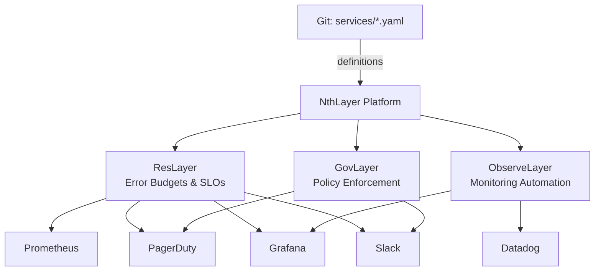
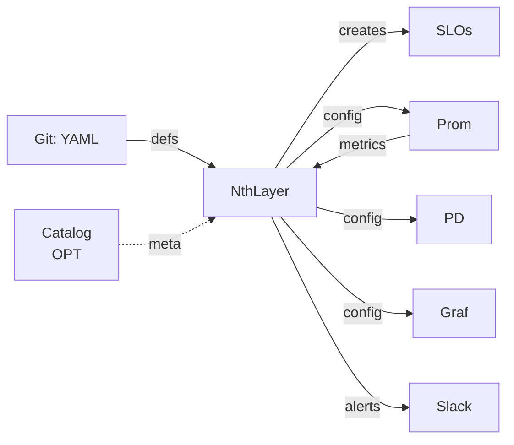

<div class="flex justify-center my-8">
  
</div>

<div class="text-center mt-8">

<div class="text-3xl font-bold mb-4">
The Missing Layer of Reliability
</div>

<div class="text-xl mb-4">
Reliability as Code
</div>

<div class="text-sm text-gray-400 italic mb-6">
Like Infrastructure as Code, but for operations
</div>

<div class="text-base">
Define services in YAML. NthLayer creates operational configs.
</div>

<div class="text-sm mt-4">
✅ No Service Catalog Required - Start today with just Git + YAML
</div>

</div>

---
layout: default
---

# Who Is This For?

### Platform Engineering & SRE Teams

Managing **20+ microservices** and drowning in operational toil

<div class="grid grid-cols-3 gap-6 mt-8">

<div class="text-center">

### 😫 Your Pain
Manual ops glue  
for every service

</div>

<div class="text-center">

### 🎯 Your Goal
Standardize  
operationalization

</div>

<div class="text-center">

### ⚡ NthLayer Result
5 minutes  
per service

</div>

</div>

<div class="text-center mt-8 text-lg">
**Today:** Problem → Solution → Demo → ROI → How to Start
</div>

---
layout: default
---

# The 20-Hour Service Onboarding Problem

For **EVERY** new service, SRE teams manually:

**Reliability Configuration (6 hours):**
- ❌ Define SLOs and calculate error budgets
- ❌ Create burn rate alerts in Prometheus
- ❌ Set up PagerDuty escalation policies

**Alert Configuration (4 hours):** ← NEW!
- ❌ Research alert best practices for each dependency
- ❌ Write Prometheus alert rules (postgres, redis, kafka, etc.)
- ❌ Configure thresholds and severity levels
- ❌ Test alerts and fix false positives

**Observability Setup (5 hours):** ← NOW AUTOMATED!
- ❌ Build Grafana dashboards (12-28 panels per service)
- ❌ Create technology-specific panels (PostgreSQL, Redis, K8s)
- ❌ Write Prometheus recording rules for performance
- ❌ Configure Prometheus scrape targets

**Deployment Safety (5 hours):**
- ❌ Link deploy tracking to observability
- ❌ Configure deployment gates and rollback criteria
- ❌ Write runbooks with troubleshooting steps

**⚠️ The Cost:** 20+ hours per service × 200 services = **4,000 hours of toil**

---
layout: default
---

# Why Another Tool?
<div class="mt-2">

### Service Catalogs Can Automate... But:

- ❌ **Require full catalog adoption** before automation works
- ❌ **Complex workflows** need templates, permissions, integrations
- ❌ **All-or-nothing** - can't start small
- ❌ **Catalog-centric** - the catalog is the source of truth

### NthLayer's Difference:

- ✅ **Start immediately** with just YAML files in Git
- ✅ **Auto-generates** SLOs, alerts, dashboards from service tier
- ✅ **Incremental adoption** - one service at a time
- ✅ **Service-centric** - code is the source of truth

</div>

**Bottom line:** Catalogs make you adopt their platform first. NthLayer works Day 1 with what you have.

---
layout: default
---

# Why Now?

<div class="grid grid-cols-2 gap-8 mt-4">

<div>

### Macro Trends

- 📈 **Cloud-native explosion** - 14,000+ CNCF projects
- 🏗️ **Platform engineering** - Gartner Top 10 trend
- 📊 **SRE adoption** - Google SRE book → industry standard
- 💰 **Efficiency pressure** - Do more with less

</div>

<div>

### The Gap Today

✅ Service catalogs track services  
✅ Observability tools exist  
✅ SLO platforms exist  

❌ **Nothing auto-generates operational configs from simple service definitions**

<div class="text-yellow-400 mt-4 font-bold">
Platform teams still write glue by hand
</div>

</div>

</div>

---
layout: default
---

# NthLayer: The Config Automation Layer

<div class="grid grid-cols-2 gap-8 mt-4">

<div>

### Input: Simple YAML

```yaml
# services/search-api.yaml
service: search-api
tier: 1
team: platform
type: api
tech_stack:
  language: java
  metrics: prometheus
```

<div class="text-sm text-gray-400 mt-2">
Just Git + YAML. No catalog required.
</div>

</div>

<div>

### Output: Operational Configs

✅ **SLOs** (OpenSLO format, tier-based)

✅ **Alerts** (400+ battle-tested rules)

✅ **PagerDuty** services, teams & escalations

✅ **Grafana dashboards** (12-28 panels) ← NEW!

✅ **Recording rules** (20+ pre-computed metrics) ← NEW!

✅ **Deploy gates** (SLO-based criteria)

✅ **Technology panels** (PostgreSQL, Redis, K8s) ← NEW!

</div>

</div>

<div class="text-center mt-4">
<div class="text-lg font-bold text-green-400">
💚 Auto-generates configs for your existing tools
</div>
<div class="text-sm text-yellow-400 mt-2">
🎯 <strong>Opinionated by Design</strong> - Strong defaults based on SRE best practices. Overridable when needed.
</div>
<div class="text-xs text-gray-500 mt-2">
Works WITH: Prometheus, Grafana, PagerDuty, Datadog, ArgoCD, Jenkins
</div>
</div>

---
layout: default
---

# Example: Auto-Generate SLOs

**💡 NthLayer CREATES SLOs for you (not just tracks them)**

<div class="grid grid-cols-2 gap-6">

<div>

**Input:**

```yaml
# services/search-api.yaml
service: search-api
tier: 1
type: api
```

**Command:**
```bash
nthlayer generate-slo \
  services/search-api.yaml
```

</div>

<div>

**Output:** OpenSLO Format

```yaml
apiVersion: openslo/v1
kind: SLO
metadata:
  name: search-api-availability
spec:
  service: search-api
  objectives:
    - displayName: 99.9% Availability
      target: 0.999
      timeWindow: 30d
```

</div>

</div>

<div class="text-center text-lg font-bold mt-4">
🎯 <span class="text-green-400">Availability SLO (99.9%)</span> • 
⚡ <span class="text-blue-400">Latency SLO (p95 < 500ms)</span> • 
💰 <span class="text-purple-400">Error Budget (43.2 min/month)</span>
</div>

---
layout: default
---

# The Value Proposition

### Time Savings Per Service

<div class="text-5xl font-bold text-center my-6">
⏱️ 20 hours → 5 minutes
</div>

### At Scale: 200 Services

<div class="grid grid-cols-2 gap-8 mt-4">

<div>

**Cost Savings:**
- ⏱️ **Time saved:** 4,000 hours (~2 engineer-years)
- 💰 **Value:** $400K+ (at $200K/engineer)
- 📉 **Ongoing:** -90% maintenance time
- 🚨 **Alerts alone:** $30K/year savings

</div>

<div>

**Quality Gains:**
- 🎯 **Consistency:** 100% standardized configs
- 🔒 **Zero drift:** Git as source of truth
- 🚀 **Velocity:** New service → prod in < 1 day
- 📊 **Coverage:** 3-5x more alerts per service

</div>

</div>

**Bottom line:** Platform team shifts from writing glue to building platform features.

---
layout: default
---

# Three Ways to Use NthLayer

<div class="grid grid-cols-3 gap-6 mt-4">

<div v-click class="p-4 border-2 border-green-500 rounded bg-gray-800">

### 1. Standalone 👍

```yaml
service: payment-api
tier: 1
team: payments
```

<div class="text-xs mt-2 text-green-400">✅ START HERE</div>

</div>

<div v-click class="p-4 border-2 border-blue-500 rounded bg-gray-800">

### 2. With Catalog

```yaml
catalog:
  type: backstage
  url: https://...
```

<div class="text-xs mt-2 text-gray-400">Optional</div>

</div>

<div v-click class="p-4 border-2 border-purple-500 rounded bg-gray-800">

### 3. Hybrid

```yaml
service: search-api
catalog_source: backstage
overrides:
  tier: 1
```

<div class="text-xs mt-2 text-gray-400">Best of both</div>

</div>

</div>

---
layout: default
---

# What NthLayer Auto-Generates

<div class="grid grid-cols-3 gap-4 mt-4">

<div v-click class="p-4 border-2 border-orange-500 rounded bg-gray-800">

### 🚨 Alerts (NEW!)
- **400+ production-tested rules**
- 46 technologies
- Auto-generated from dependencies
- <span class="text-orange-400 font-bold">4 hours → 5 min</span>

</div>

<div v-click class="p-4 border-2 border-green-500 rounded bg-gray-800">

### 🎯 Reliability
- SLOs & error budgets
- Burn rate alerts
- Prometheus integration

</div>

<div v-click class="p-4 border-2 border-red-500 rounded bg-gray-800">

### 📞 Incident Response
- PagerDuty services & teams
- Escalation policies
- Runbook templates

</div>

<div v-click class="p-4 border-2 border-blue-500 rounded bg-gray-800">

### 📊 Observability
- Grafana dashboards
- Prometheus configs
- Datadog monitors

</div>

<div v-click class="p-4 border-2 border-purple-500 rounded bg-gray-800">

### 🚀 Deployment
- Deploy correlation
- Deployment gates
- Rollback triggers

</div>

<div v-click class="p-4 border-2 border-cyan-500 rounded bg-gray-800">

### 🏗️ Platform Setup
- Service objects
- Team memberships
- Integration keys

</div>

</div>

<div v-click class="text-center mt-2 text-xs text-gray-400">
⭐ All from a single YAML file • No manual clicking
</div>

---
layout: default
---

# Deploy Correlation: The Safety Net

**Automatically correlates incidents to deployments and blocks bad releases**

<div class="grid grid-cols-2 gap-8 mt-6">

<div>

### How It Works

1. **Monitor** - Track error budget burn after each deploy
2. **Correlate** - 3-factor confidence scoring:
   - **Time proximity** (deploy → incident timing)
   - **Service dependencies** (if defined)
   - **Historical patterns** (past deploy issues)
3. **Act** - Block CI/CD pipeline if confidence > 80%

<div class="text-xs text-gray-400 mt-2">
*Dependencies can be defined in YAML or auto-discovered from service mesh*
</div>

</div>

<div>

### Integrations

**CI/CD Platforms:**
- ✅ ArgoCD, Jenkins
- ✅ GitHub Actions, GitLab

**Dependency Discovery:**
- ✅ Static YAML
- ✅ Istio/Linkerd
- ✅ Service catalogs

<div class="text-yellow-400 mt-2 font-bold">
⚠️ Prevents cascading failures
</div>

</div>

</div>

**Example:** Deploy v2.3.1 → Error rate spikes 3 min later → NthLayer blocks ArgoCD promotion to prod cluster

---
layout: default
---

# Real-World Impact

<div class="grid grid-cols-3 gap-4 mt-4">

<div class="p-4 border-2 border-green-500 rounded">

### 🚀 Startup  
**50 services, no ops infrastructure**

**Before:** 1,000 hours of ops work  
**After:** 4 hours with NthLayer

<div class="text-green-400 mt-2 font-bold">
Launched in 1 week vs 6 weeks
</div>

</div>

<div class="p-4 border-2 border-blue-500 rounded">

### 📈 Scale-Up  
**200 services, inconsistent configs**

**Before:** 2 FTEs maintaining configs  
**After:** 0.2 FTE with NthLayer

<div class="text-blue-400 mt-2 font-bold">
1.8 engineers → product work
</div>

</div>

<div class="p-4 border-2 border-purple-500 rounded">

### 🏢 Enterprise  
**1,000 services, multi-team chaos**

**Before:** 20,000 hours, multi-quarter migration  
**After:** 100 hours automated

<div class="text-purple-400 mt-2 font-bold">
$2M+ value, 3 months faster
</div>

</div>

</div>

---
layout: section
---

# The Three Layers

ResLayer • GovLayer • ObserveLayer

---
layout: default
---

# The Three Layers

<div class="flex justify-center">



</div>

---
layout: default
---

# ObserveLayer: Auto-Generated Dashboards & Recording Rules ✨

**NEW: Complete observability automation in one command**

<div class="grid grid-cols-2 gap-6 mt-6">

<div>

### What Gets Generated

```bash
# Generate dashboard (12-28 panels)
$ nthlayer generate-dashboard service.yaml

# Generate recording rules (20+)
$ nthlayer generate-recording-rules service.yaml
```

**Dashboard panels:**
- 3 SLO panels (availability, latency)
- 3 Health panels (requests, errors, latency)
- 6-22 Technology panels (auto-detected)

</div>

<div>

### Technology Templates

**40 production-grade panels:**

✅ **PostgreSQL** (12 panels)  
- Connections, cache hit ratio, queries
- Replication lag, table bloat, indexes

✅ **Redis** (10 panels)  
- Memory, hit rate, evictions
- Fragmentation, slow commands

✅ **Kubernetes** (10 panels)  
- Pods, CPU, memory, restarts, OOM kills

✅ **HTTP/API** (8 panels)  
- Request rate, errors, latency by endpoint

</div>

</div>

---
layout: default
---

# Performance: 10x Faster Dashboards

**Recording rules pre-compute expensive queries for instant dashboards**

<div class="grid grid-cols-2 gap-8 mt-6">

<div>

### Before (Without Recording Rules)

```yaml
# Dashboard queries on every load
histogram_quantile(0.95,
  rate(http_request_duration_seconds_bucket
    {service="payment-api"}[5m])
)
```

<div class="mt-4">

⏱️ **Query time:** 500-2000ms  
📊 **Dashboard load:** 5-10 seconds  
💰 **Prometheus CPU:** High

</div>

</div>

<div>

### After (With Recording Rules)

```yaml
# Pre-computed metric
service:http_request_duration_seconds:p95
  {service="payment-api"}
```

<div class="mt-4">

⚡ **Query time:** 10-50ms (50x faster!)  
📊 **Dashboard load:** <1 second  
💰 **Prometheus CPU:** Low

</div>

</div>

</div>

<div class="text-center mt-6 text-green-400 font-bold text-lg">
Result: 10x faster dashboards, 100x faster complex queries
</div>

---
layout: default
---

# Dashboard Modes: Overview vs Full

<div class="grid grid-cols-2 gap-8 mt-4">

<div>

### Overview Mode (Default)

```bash
nthlayer generate-dashboard service.yaml
```

**12 panels - Best for daily monitoring**

- 3 SLO panels
- 3 Health panels  
- 6 Technology panels (top 3 from each)

<div class="mt-4 text-sm text-gray-400">
Perfect for: Team dashboards, at-a-glance health
</div>

</div>

<div>

### Full Mode

```bash
nthlayer generate-dashboard service.yaml --full
```

**28+ panels - Best for troubleshooting**

- 3 SLO panels
- 3 Health panels
- 22+ Technology panels (all available)

<div class="mt-4 text-sm text-gray-400">
Perfect for: Incident response, deep investigation
</div>

</div>

</div>

<div class="text-center mt-6">
<span class="text-yellow-400">💡 Pro tip:</span> Generate both! Use overview daily, switch to full when troubleshooting
</div>

---
layout: default
---

# ResLayer: Architecture & What's Working Today

<div class="grid grid-cols-2 gap-4 mt-4">

<div>

### Architecture

<div class="flex justify-center">



</div>

**Standalone-first:** • No catalog • Git source of truth

</div>

<div>

### Available Now ✅

<div v-click class="text-sm">

📋 **SLOs** • Auto-gen from tier

</div>

<div v-click class="text-sm">

📊 **Error Budgets** • Real-time

</div>

<div v-click class="text-sm">

🔗 **Deploy Correlation** • Blocks bad deploys

</div>

<div v-click class="text-sm">

🚨 **Alerting** • Burn rate alerts

</div>

<div v-click class="text-sm">

🏗️ **Services** • Auto-creates in PagerDuty

</div>

<div v-click class="text-sm">

⌨️ **CLI** • 9 commands

</div>

</div>

</div>

---
layout: default
---

# Alert Generation: From Hours to Minutes

**The #1 time sink: Researching and configuring alerts for every dependency**

<div class="grid grid-cols-2 gap-6 mt-4">

<div>

### Before (4 hours) ❌

1. **Research** (1 hour)
   - Google "postgres alert best practices"
   - Read documentation
   - Ask senior engineers

2. **Configure** (2 hours)
   - Write 15+ alert rules
   - Set thresholds
   - Add labels

3. **Test & Document** (1 hour)
   - Validate syntax
   - Test firing
   - Update runbooks

**Result:** 5-10 alerts, variable quality

</div>

<div>

### After (5 minutes) ✅

1. **Define Dependencies** (2 min)
   ```yaml
   dependencies:
     databases:
       - type: postgres
       - type: redis
   ```

2. **Generate** (3 seconds)
   ```bash
   nthlayer generate-alerts
   ```

3. **Deploy** (3 minutes)
   ```bash
   kubectl apply -f alerts.yaml
   ```

**Result:** 27 alerts, battle-tested

</div>

</div>

<div class="text-center mt-4">
<span class="text-3xl font-bold text-orange-400">48x faster</span> • 
<span class="text-2xl font-bold text-green-400">400+ production-tested rules</span> • 
<span class="text-2xl font-bold text-blue-400">46 technologies</span>
</div>

---
layout: default
---

# Alert Technology Coverage

**46 Technologies Across 10 Categories**

<div class="grid grid-cols-2 gap-4 mt-4 text-sm">

<div>

**Databases (14):**  
postgres • mysql • redis • mongodb • elasticsearch • cassandra • couchdb • clickhouse • sqlserver • etcd • consul • minio • zookeeper

**Brokers (5):**  
kafka • rabbitmq • nats • pulsar

**Proxies (5):**  
nginx • haproxy • traefik • apache • caddy

**Orchestrators (4):**  
kubernetes • nomad • istio • linkerd

**Storage (3):**  
minio • ceph • zfs

</div>

<div>

**Infrastructure (5):**  
consul • etcd • vault • coredns • zookeeper

**Observability (5):**  
prometheus • loki • thanos • cortex • promtail

**CI/CD (3):**  
jenkins • argocd • fluxcd

**Runtimes (3):**  
jvm • php-fpm • sidekiq

**Systems/Security (4):**  
host • docker • windows • blackbox

</div>

</div>

<div class="text-center mt-4">
<div class="text-xl font-bold text-green-400">Covers 90% of modern infrastructure stacks</div>
<div class="text-sm text-gray-400 mt-2">Source: awesome-prometheus-alerts (CC BY 4.0) - Used by thousands of engineers</div>
</div>

---
layout: default
---

# Complete Workflow Example

<div class="grid grid-cols-2 gap-6">

<div>

**1. Define Service**
```yaml
service: payment-api
tier: critical
team: payments
dependencies:
  databases:
    - type: postgres
    - type: redis
```

**2. Run Commands**
```bash
# Generate SLOs
nthlayer generate-slo payment-api.yaml

# Generate alerts (NEW!)
nthlayer generate-alerts payment-api.yaml

# Setup PagerDuty
nthlayer setup-pagerduty payment-api.yaml
```

</div>

<div>

**3. Generated Output**

```
✅ SLOs created (2):
   • payment-api-availability (99.9%)
   • payment-api-latency-p95

✅ Alerts generated (27):
   • 15 postgres alerts
   • 12 redis alerts
   • All customized with service labels

✅ PagerDuty service created:
   • High-urgency escalation
   • Linked to payments team

✅ Ready to deploy in < 5 minutes
```

</div>

</div>

<div class="text-center mt-6 text-xl font-bold">
🚀 From YAML to Production-Ready Configs in < 5 minutes
</div>

<div class="text-center mt-2 text-sm text-orange-400">
✨ Includes 27 auto-generated alerts from awesome-prometheus-alerts
</div>

---
layout: default
---

# With vs Without Service Catalog

<div class="grid grid-cols-2 gap-6 mt-8">

<div>

## Without Catalog

```yaml
service: search-api
tier: 1
```

✅ Start immediately • No dependencies

<div class="mt-2 text-green-400 font-bold">
👍 START HERE
</div>

</div>

<div>

## With Catalog

```yaml
catalog:
  type: backstage
```

✅ Sync metadata • Single source

<div class="mt-2 text-gray-400">
Optional
</div>

</div>

</div>

---
layout: default
---

# Use Cases by Persona

<div class="grid grid-cols-2 gap-6 mt-4">

<div>

### 🚀 Early-Stage Startup
**Persona:** CTO with 20-50 services

**Scenario:** No ops infrastructure yet, tight on resources

**NthLayer solves:**
- Get production-grade SLOs without hiring SRE team
- Standardize monitoring from day 1
- Avoid technical debt

**Outcome:** Professional ops with startup budget

</div>

<div>

### 📈 Growth-Stage Company
**Persona:** VP Engineering with 100-500 services

**Scenario:** Backstage exists but not fully adopted, inconsistent configs

**NthLayer solves:**
- Operationalize services immediately (don't wait for catalog adoption)
- Standardize across teams
- Reduce platform team toil

**Outcome:** Consistent ops without forcing catalog migration

</div>

<div>

### 🏢 Enterprise Platform Team
**Persona:** Principal Engineer with 500+ services

**Scenario:** Multiple legacy systems, complex integrations, governance needs

**NthLayer solves:**
- Bridge existing tools without rip-and-replace
- Enforce standards via code
- Gradual migration path

**Outcome:** Standardization without disruption

</div>

<div>

### 🔧 DevOps Consultant
**Persona:** Consultant helping clients with ops maturity

**Scenario:** Need repeatable patterns across multiple clients

**NthLayer solves:**
- Packageable best practices
- Quick client value demos
- Scalable consulting model

**Outcome:** Client success faster, more engagements

</div>

</div>

---
layout: section
---

# Competitive Positioning

How NthLayer compares

---
layout: default
---

# Competitive Landscape

<div class="text-xs">

| Feature | Catalogs<br/>(Backstage) | SLO Tools<br/>(Nobl9) | Cortex | Port | ⭐ **NthLayer** |
|---------|-----------------|---------------|--------|------|----------|
| **Auto-gen SLOs** | Via workflows* | Manual | No | No | <span class="text-green-400">✅ Built-in</span> |
| **Auto-gen Alerts** | No | No | No | No | <span class="text-orange-400 font-bold">✅ 400+ rules</span> |
| **Multi-tool configs** | Via templates* | No | No | No | <span class="text-green-400">✅ Auto</span> |
| **Prometheus Integration** | Manual | No | No | No | <span class="text-green-400">✅ Built-in</span> |
| **Adoption friction** | 🔴 High | 🟡 Medium | 🟡 Medium | 🔴 High | <span class="text-green-400">🟢 Low</span> |
| **Catalog required?** | ✅ Yes | No | Optional | ✅ Yes | <span class="text-green-400">Optional</span> |
| **Works Day 1?** | No* | No** | No | No | <span class="text-green-400">✅ Yes</span> |
| **Source of truth** | Catalog | External | Catalog | Catalog | <span class="text-green-400">Code</span> |

<div class="mt-2">
*Requires full catalog adoption, workflow setup  
**Requires manual SLO creation first
</div>

</div>

<div class="text-xs mt-2">
<strong>NthLayer</strong> = Config automation layer • <span class="text-orange-400 font-bold">Only platform with auto-generated alerts</span>
</div>

---
layout: section
---

# Roadmap

From ResLayer to Full Platform

---
layout: default
---

# Roadmap

<div class="grid grid-cols-3 gap-6 mt-4">

<div v-click class="p-4 border-2 border-green-500 rounded">

### Phase 1: ResLayer ✅
**Available Now**

- SLO generation
- Error budget tracking
- Deploy correlation
- Slack + PagerDuty alerts
- CLI interface

</div>

<div v-click class="p-4 border-2 border-blue-500 rounded">

### Phase 2: GovLayer
**Q2 2025**

- Policy engine
- Compliance checks
- Cost governance
- Resource limits
- Approval workflows

</div>

<div v-click class="p-4 border-2 border-purple-500 rounded">

### Phase 3: ObserveLayer
**Q3 2025**

- Grafana integration
- Datadog monitors
- Log aggregation
- Trace correlation
- Full observability

</div>

</div>

---
layout: section
---

# Get Started Today

---
layout: default
---

# Quick Start: Local Setup

**Generate operational configs locally - no external integrations required yet**

```bash
# 1. Install
pip install nthlayer

# 2. Define a service
echo 'service: my-api
tier: 1
type: api' > services/my-api.yaml

# 3. Generate SLO configs
nthlayer generate-slo services/my-api.yaml
```

**✅ Result:** OpenSLO files generated and ready to deploy

<div class="text-sm text-gray-400 mt-4">
*Integrating with PagerDuty, Slack, and Prometheus takes ~15 minutes (API keys + config). See docs for full setup.*
</div>

---
layout: center
---

# Thank You!

<div class="text-center mt-8">

**Get in touch:**

- 🔗 **GitHub:** github.com/yourname/nthlayer
- 📚 **Docs:** nthlayer.dev  
- 📧 **Email:** hello@nthlayer.dev

<div class="mt-8 text-2xl font-bold text-blue-400">
💙 Try ResLayer today!
</div>

<div class="mt-8 text-gray-500">
Questions?
</div>

</div>
