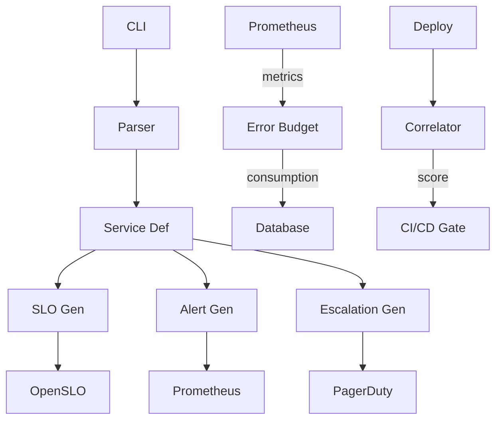

# NthLayer

## Technical Deep Dive

**Architecture, CLI, and Implementation**

<div class="mt-4 text-sm">
For Platform Engineers & SREs
</div>

<div class="mt-4 text-orange-400 font-bold">
🚨 Featuring: 400+ Auto-Generated Alerts from awesome-prometheus-alerts
</div>

---
layout: default
---

<div class="text-sm">

# Today's Agenda

<div class="grid grid-cols-2 gap-6 mt-4">

<div>

### Part 1: Architecture
- System design principles
- ResLayer internals
- Database schema
- Integration architecture

</div>

<div>

### Part 2: CLI & Usage
- All 9 commands
- YAML schema
- Real examples
- Best practices

</div>

<div>

### Part 3: Extensibility
- Plugin architecture
- API design
- Performance
- Security

</div>

<div>

### Part 4: Q&A
- Technical questions
- Implementation details

</div>

</div>

</div>

---
layout: section
---

# Part 1: Architecture

System Design & Implementation

---
layout: default
---

<div class="text-xs">

# System Design Principles

<div class="grid grid-cols-2 gap-4 mt-1">

<div>

### Core Tenets

**1. Git as Source of Truth**
- YAML in version control
- No DB for definitions

**2. Opinionated Defaults**
- Tier-based SLO targets
- Override when needed

**3. Tool Agnostic**
- Any monitoring stack
- OpenSLO standard

</div>

<div>

### Design Rationale

**Git-native:**
- Teams already use Git
- PR workflow familiar

**Opinionated:**
- SRE best practices
- Consistency

**Tool-agnostic:**
- Use existing tools
- Incremental adoption

</div>

</div>

</div>

---
layout: default
---

<div class="text-xs">

# ResLayer Architecture



**Components:** Parser • Generators • Integrations • Correlator

</div>

---
layout: default
---

<div class="text-xs">

# Database Schema

**SQLite for operational state (not service definitions)**

<div class="grid grid-cols-2 gap-4 mt-2">

<div>

**`slos`**
```
id, service_name, slo_type,
target, time_window, created_at
```

**`error_budgets`**
```
id, slo_id, window_minutes,
budget_minutes, consumed_minutes
```

**`deploys`**
```
id, service_name, version,
deployed_at, commit_hash
```

</div>

<div>

**`incidents`**
```
id, service_name, started_at,
resolved_at, severity
```

**`correlations`**
```
id, deploy_id, incident_id,
confidence_score, factors
```

**Design:**
- Alembic migrations
- Indexed on service_name
- No cascade deletes

</div>

</div>

</div>

---
layout: default
---

<div class="text-xs">

# SLO Generation Logic

**Tier-based defaults:**

```python
def generate_slo_targets(tier: int) -> dict:
    targets = {
        1: {"availability": 0.999, "latency_p95_ms": 500},
        2: {"availability": 0.995, "latency_p95_ms": 1000},
        3: {"availability": 0.990, "latency_p95_ms": 2000},
    }
    return targets.get(tier, targets[3])
```

**Output:** OpenSLO format with calculated budgets

</div>

---
layout: default
---

<div class="text-xs">

# Error Budget Calculation

<div class="grid grid-cols-2 gap-4">

<div>

**Formula:**

```python
def calculate_error_budget(
    slo_target: float,
    time_window_days: int,
    error_rate: float
) -> dict:
    window_min = time_window_days * 1440
    budget_min = (1 - slo_target) * window_min
    consumed = error_rate * window_min
    remaining = budget_min - consumed
    
    return {
        "total": budget_min,
        "consumed": consumed,
        "remaining": remaining
    }
```

</div>

<div>

**Example:**

Service: payment-api  
Tier: 1 (99.9%)  
Window: 30 days

- Total: 43.2 min/month
- Error rate: 0.05%
- Consumed: 21.6 min
- Remaining: 21.6 min (50%)

**Alerts:** <25%, <10%, <5%

</div>

</div>

</div>

---
layout: default
---

<div class="text-xs">

# Deploy Correlation Algorithm

**3-factor confidence scoring:**

```python
def calculate_correlation_confidence(deploy, incident) -> float:
    # Factor 1: Time proximity (0.0 - 0.5)
    time_delta = (incident.started_at - deploy.deployed_at).seconds
    time_score = max(0, 0.5 - (time_delta / 3600) * 0.1)
    
    # Factor 2: Dependencies (0.0 - 0.3)
    dependency_score = 0.3 if related_services else 0.0
    
    # Factor 3: Historical patterns (0.0 - 0.2)
    history_score = 0.2 if similar_incidents else 0.0
    
    return min(1.0, time_score + dependency_score + history_score)
```

**Blocks deploy if > 0.8 confidence**

</div>

---
layout: section
---

# Part 2: CLI Deep Dive

All 9 Commands Explained

---
layout: default
---

<div class="text-xs">

# CLI Command Overview

<div class="grid grid-cols-3 gap-3 mt-2">

<div>

**SLO Management**
```bash
nthlayer generate-slo
nthlayer validate
nthlayer list-templates
```

</div>

<div>

**Alert Generation** ← NEW!
```bash
nthlayer generate-alerts
# 400+ rules, 46 technologies
```

</div>

<div>

**Deploy Safety**
```bash
nthlayer check-deploy
# Error budget gates
```

</div>

<div>

**Integration**
```bash
nthlayer setup-pagerduty
nthlayer setup-prometheus
```

</div>

<div>

**Utilities**
```bash
nthlayer validate
nthlayer dry-run
```

</div>

</div>

</div>

---
layout: default
---

<div class="text-xs">

# Command: `generate-alerts` ← NEW!

**Auto-generate 400+ production-tested alert rules**

<div class="grid grid-cols-2 gap-4 mt-2">

<div>

**Usage:**
```bash
nthlayer generate-alerts \
  services/payment-api.yaml \
  --runbook-url https://runbooks.company.com
```

**How it works:**
1. Reads Dependencies from service YAML
2. Loads alerts for each technology
3. Filters by service tier
4. Customizes with service labels
5. Outputs Prometheus-ready YAML

**Output:** 27 alerts in 2 seconds

</div>

<div>

**Features:**
- ✅ **46 technologies** (postgres, redis, kafka, k8s, etc.)
- ✅ **400+ alert rules** from awesome-prometheus-alerts
- ✅ **Tier-based filtering** (critical/standard/low)
- ✅ **Auto-customized** (service labels, runbooks)

**Example Output:**
```yaml
alert: PostgresqlDown
labels:
  severity: critical
  service: payment-api
  team: payments
annotations:
  runbook: https://runbooks.../PostgresqlDown
```

</div>

</div>

</div>

---
layout: default
---

<div class="text-xs">

# Command: `generate-slo`

**Auto-generate SLOs from service definition**

<div class="grid grid-cols-2 gap-4 mt-2">

<div>

**Usage:**
```bash
nthlayer generate-slo \
  services/payment-api.yaml \
  --output slos/ \
  --format openslo
```

**Options:**
```
--output PATH     Output dir
--format FORMAT   openslo|prometheus
--dry-run        Preview only
```

</div>

<div>

**Input:**
```yaml
service: payment-api
tier: 1
team: payments
```

**Output:**
```
slos/
  payment-api-availability.yaml
  payment-api-latency-p95.yaml
```

</div>

</div>

</div>

---
layout: default
---

<div class="text-xs">

# Command: `track-budget`

**Real-time error budget tracking**

<div class="grid grid-cols-2 gap-4 mt-2">

<div>

**Usage:**
```bash
nthlayer track-budget \
  --service payment-api \
  --prometheus http://localhost:9090 \
  --interval 5m
```

</div>

<div>

**Output:**
```
📊 Error Budget: payment-api
SLO: 99.9% (30d)

Budget: 43.2 min/month
Consumed: 18.7 min (43%)
Remaining: 24.5 min (57%)

Status: 🟢 HEALTHY
```

</div>

</div>

</div>

---
layout: default
---

<div class="text-xs">

# Command: `correlate-deploy`

**Link deployments to incidents**

<div class="grid grid-cols-2 gap-4 mt-2">

<div>

**Usage:**
```bash
nthlayer correlate-deploy \
  --deploy v2.3.1 \
  --service payment-api \
  --time-window 1h
```

</div>

<div>

**Output:**
```
🔍 Correlation Analysis

Deploy: payment-api v2.3.1

Incidents:
  #4521: High error rate
    Confidence: 89% 🔴
    Factors: Time(0.45) + Deps(0.30)
    
Action: BLOCK further deploys
```

</div>

</div>

</div>

---
layout: default
---

<div class="text-xs">

# YAML Schema

```yaml
# Required
service: payment-api
tier: 1
team: payments

# Optional
type: api
tech_stack:
  metrics: prometheus

# Overrides
observability:
  slo_overrides:
    availability: 0.9995

# Dependencies
dependencies:
  upstream: [user-service]

# PagerDuty
pagerduty:
  service_id: PXXXXXX
```

</div>

---
layout: default
---

<div class="text-xs">

# Integration: PagerDuty

**Auto-creates services via API**

<div class="grid grid-cols-2 gap-4 mt-2">

<div>

**What Gets Created:**

1. Service object
2. Team object (if needed)
3. Escalation policy
4. Integration keys

**Flow:**
```
YAML → CLI → API
  → Check if exists
  → Create or update
  → Return service key
```

</div>

<div>

**Example:**
```python
service = pd_client.create_service({
    "name": "payment-api",
    "escalation_policy_id": policy_id,
    "alert_creation": "create_alerts"
})
```

**Credentials:**
```bash
export PAGERDUTY_API_KEY=xxx
```

Idempotent - safe to re-run

</div>

</div>

</div>

---
layout: default
---

<div class="text-xs">

# Integration: Prometheus

<div class="grid grid-cols-2 gap-3 mt-1">

<div>

**Scrape Config:**
```yaml
scrape_configs:
  - job_name: 'payment-api'
    static_configs:
      - targets: ['payment-api:8080']
```

**Recording Rules:**
```yaml
groups:
  - name: payment-api-slos
    rules:
      - record: slo:availability:ratio
        expr: sum(rate(http_requests_total{
            job="payment-api", code!~"5.."
          }[5m]))
```

</div>

<div>

**Alerts:**
```yaml
groups:
  - name: payment-api-alerts
    rules:
      - alert: HighErrorBudgetBurn
        expr: slo:availability:ratio < 0.999
        for: 5m
        labels:
          severity: warning
```

Mount into Prometheus config dir

</div>

</div>

</div>

---
layout: default
---

<div class="text-xs">

# Complete Workflow

**Operationalize a service in 5 minutes:**

```bash
# 1. Initialize from template
nthlayer init payment-api --team payments --template critical-api

# 2. Generate SLOs
nthlayer generate-slo payment-api.yaml

# 3. Generate alerts (NEW!)
nthlayer generate-alerts payment-api.yaml
# ✅ 27 alerts generated for postgres & redis

# 4. Setup PagerDuty
nthlayer setup-pagerduty payment-api.yaml --api-key KEY

# 5. Check deployment safety
nthlayer check-deploy payment-api.yaml
# ✅ or ❌ based on error budget
```

**Time:** 5 minutes vs 20 hours manual setup

</div>

---
layout: default
---

<div class="text-xs">

# Testing & Validation

<div class="grid grid-cols-2 gap-4 mt-2">

<div>

**Unit Tests (pytest):**
```bash
pytest tests/ -v --cov=src
```

Coverage: 85%  
20 tests passing

**Tests cover:**
- SLO generation
- Error budget calc
- Deploy correlation
- OpenSLO validation
- API mocking

</div>

<div>

**Integration Tests:**
```bash
pytest tests/integration/ \
  --prometheus-url http://localhost:9090
```

**Validation:**
```bash
# Validate YAML
nthlayer validate services/*.yaml

# Check output
nthlayer validate --output slos/
```

</div>

</div>

</div>

---
layout: section
---

# Part 3: Extensibility

Plugins, API, Performance

---
layout: default
---

<div class="text-xs">

# Plugin Architecture (Future)

<div class="grid grid-cols-2 gap-4 mt-2">

<div>

**Plugin Types:**

1. SLO Generators
2. Platform Integrations
3. Output Formats

**Example:**
```python
from nthlayer.plugin import SLOGenerator

class FinancialSLO(SLOGenerator):
    def generate(self, service):
        return {
            "availability": 0.9999,
            "latency_p99": 200,
            "audit_logging": True
        }
```

</div>

<div>

**Usage:**
```bash
nthlayer generate-slo \
  --plugin plugins/financial.py \
  services/payment-api.yaml
```

**Benefits:**
- Custom tier mappings
- Industry-specific SLOs
- Compliance requirements
- Internal tool integrations

</div>

</div>

</div>

---
layout: default
---

<div class="text-xs">

# API Design (Future)

**RESTful API for programmatic access:**

```
POST   /api/v1/services              # Create config
GET    /api/v1/services/{name}       # Get details
PUT    /api/v1/services/{name}       # Update
DELETE /api/v1/services/{name}       # Remove

POST   /api/v1/slos/generate         # Generate SLOs
GET    /api/v1/slos/{service}        # Get SLOs

GET    /api/v1/error-budgets/{slo}  # Budget status
POST   /api/v1/deploys               # Record deploy
POST   /api/v1/deploys/correlate    # Check correlation
```

**Auth:** API keys or OAuth2  
**Rate Limiting:** 1000 req/min

</div>

---
layout: default
---

<div class="text-xs">

# Performance Characteristics

<div class="grid grid-cols-2 gap-4 mt-2">

<div>

**SLO Generation:**
- 1 service: < 100ms
- 100 services: ~5 sec
- 1,000 services: ~45 sec
- Bottleneck: None (CPU)

**Error Budget Calc:**
- 1 SLO: ~200ms
- 100 SLOs: ~20 sec
- 1,000 SLOs: ~3 min
- Bottleneck: Prometheus

</div>

<div>

**Deploy Correlation:**
- 1 deploy: ~50ms
- 10 deploys/min: OK
- 100 deploys/min: Needs cache
- Bottleneck: Database

**Resources:**
- Memory: ~50MB base
- CPU: Minimal
- Disk: ~100KB/service
- Network: API calls only

</div>

</div>

</div>

---
layout: default
---

<div class="text-xs">

# Security

<div class="grid grid-cols-2 gap-4 mt-2">

<div>

**Credentials:**
```bash
# Env vars (recommended)
export PAGERDUTY_API_KEY=xxx

# Or secrets manager
nthlayer config set pagerduty.api_key \
  --from-vault vault://secret/pd
```

**Never commit to Git!**

**API Permissions:**
- PagerDuty: Read/Write Services
- Prometheus: Read-only
- ArgoCD: Rollback only

</div>

<div>

**Audit Trail:**
```python
{
  "timestamp": "2025-11-21T14:30:00Z",
  "action": "generate_slo",
  "service": "payment-api",
  "user": "john@company.com",
  "result": "success"
}
```

**Compliance:** PCI-DSS, SOC2 ready

</div>

</div>

</div>

---
layout: default
---

<div class="text-xs">

# Best Practices

<div class="grid grid-cols-2 gap-4 mt-2">

<div>

**Organization:**
```
services/
  tier-1/
    payment-api.yaml
  tier-2/
    notifications.yaml
  tier-3/
    analytics.yaml
```

**Naming:**
```yaml
# Good
service: payment-api
team: payments

# Bad
service: PaymentAPI_v2_PROD
```

</div>

<div>

**Workflow:**
1. Validate YAML locally
2. Use `--dry-run`
3. Test in staging
4. Monitor budgets

**Version Control:**
- Commit YAMLs to Git
- Generated configs separate
- PR reviews required
- Tag releases

</div>

</div>

</div>

---
layout: default
---

<div class="text-xs">

# Troubleshooting

<div class="grid grid-cols-2 gap-4 mt-2">

<div>

**SLO not generating:**
```bash
nthlayer validate services/my-api.yaml
nthlayer generate-slo --dry-run
```

**Budget tracking shows 0%:**
```bash
# Test Prometheus query
curl http://prometheus:9090/api/v1/query\
  ?query=up{job="my-api"}
```

</div>

<div>

**PagerDuty 401 error:**
```bash
# Test API key
curl -H "Authorization: Token $KEY" \
  https://api.pagerduty.com/services
```

**Low correlation confidence:**
- Add dependencies to YAML
- Increase time window
- Wait for more history

</div>

</div>

</div>

---
layout: default
---

<div class="text-sm">

# Roadmap

<div class="grid grid-cols-3 gap-3 mt-4">

<div class="p-3 border-2 border-green-500 rounded">

**Q1 2025 ✅**
- Composite SLOs
- Multi-window tracking
- Grafana integration
- Datadog service creation

</div>

<div class="p-3 border-2 border-blue-500 rounded">

**Q2 2025**
- Plugin architecture
- REST API
- Dependency auto-discovery
- Advanced correlation

</div>

<div class="p-3 border-2 border-purple-500 rounded">

**Q3 2025**
- Kubernetes operator
- GitOps (Flux)
- Policy engine (OPA)
- Cost tracking

</div>

</div>

</div>

---
layout: center
---

# Questions?

<div class="mt-6 text-sm">

**Resources:**

- 📚 **Docs:** docs.nthlayer.dev/api
- 💻 **GitHub:** github.com/yourname/nthlayer
- 💬 **Slack:** slack.nthlayer.dev #architecture

</div>
